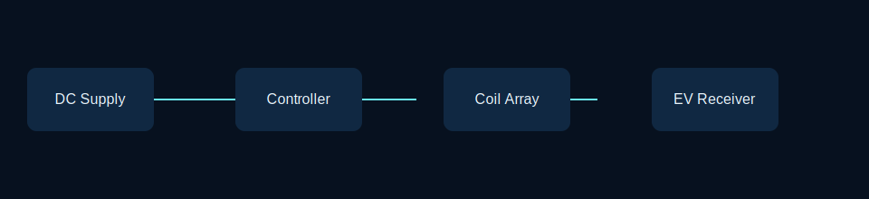

<<<<<<< HEAD
# ∿ AVCR LAB

> **Adaptive EV Charging Road Wireless**  
=======
# ∿ AWCR LAB

> **Adaptive Wireless Charging Road for Electric Vehicles**  
>>>>>>> 3dce786c4ad111227bf59759111f2b9bf8590176
> *Powering the Future Without Wires.*

[](https://scooterxd69.github.io/Science-Project/) [](#research-notes)

<p align="center"></p>

AWCR is an interactive research showcase for a miniature **dynamic wireless EV charging** prototype. It explains how segmented road coils, vehicle detection, inductive transfer, and feedback can work together to transfer energy while a vehicle is moving.

## Highlights

- Original, responsive engineering interface designed for GitHub Pages
- Interactive road demonstrator with live zone, battery, power, and efficiency feedback
- Vector blueprint viewer with zoom, contrast mode, dimensions, and callouts
- Research notes covering electromagnetic induction, mutual inductance, resonance, and dynamic charging
- Accessible semantic structure, keyboard-operable controls, and reduced-motion-friendly CSS
- Zero production dependencies and no build requirement

## Quick start

```bash
git clone https://github.com/scooterxd69/Science-Project.git
cd Science-Project
npm run check
npm start
```

Open the local URL printed by `serve`. The website can also be opened directly through `index.html`.

## Working principle

1. An IR sensor detects a vehicle over a local road section.
2. The controller energises only that section's transmitter coil.
3. A changing magnetic field couples with the receiver coil beneath the EV.
4. The receiver rectifies the induced output and updates the battery monitor.
5. As the vehicle moves, the active zone changes and previous zones return to standby.

## Architecture

```text
DC supply → zone controller → transmitter array ))) receiver coil → battery monitor
                  ↑
             IR detection
```

## Repository map

```text
├── index.html                 # GitHub Pages entry point
├── src/
│   ├── css/main.css           # Design system and responsive layout
│   ├── js/app.js              # Demo controls and UI behaviour
│   └── data/content.js        # Structured component and team data
├── research/                  # Reading list and research context
├── blueprints/                # Drawing asset guidance
├── diagrams/                  # Original SVG system diagram
├── scripts/check-site.mjs     # Lightweight structural check
└── docs/                      # Deployment notes
```

## Development

This is deliberately a native HTML/CSS/ES module project. Keep assets relative to the repository root so that the site works from GitHub Pages without a bundler.

```bash
npm run check
```

The check verifies that the expected page entry points and module links are present. Manually check the road slider, navigation menu, blueprint controls, keyboard focus, and narrow viewport before opening a pull request.

## Roadmap

- [x] Interactive charging-zone demonstrator
- [x] Blueprint visualisation
- [x] Research and repository documentation
- [ ] Instrumented prototype telemetry import
- [ ] Measured coil-efficiency comparison data
- [ ] Fabrication drawings and safety test report

## Research notes

This repository is an educational engineering presentation, not a certified charging system. Consult [the reading list](research/reading-list.md) for foundational sources and project framing.

## Contributing

Contributions are welcome—please read [CONTRIBUTING.md](CONTRIBUTING.md), [CODE_OF_CONDUCT.md](CODE_OF_CONDUCT.md), and [SECURITY.md](SECURITY.md) first.

## Team

<<<<<<< HEAD
Naitik Singh · Shreyansh Tiwari · Shivam Rai · Kushagra Tiwari · Ayan Ahmed · Suraj Kumar · Aditya Dwivedi
=======
Naitik Singh · Shreyansh Tiwari · Shivam Rai · Ayan Ahmed · Suraj Kumar · Aditya Dwivedi
>>>>>>> 3dce786c4ad111227bf59759111f2b9bf8590176
